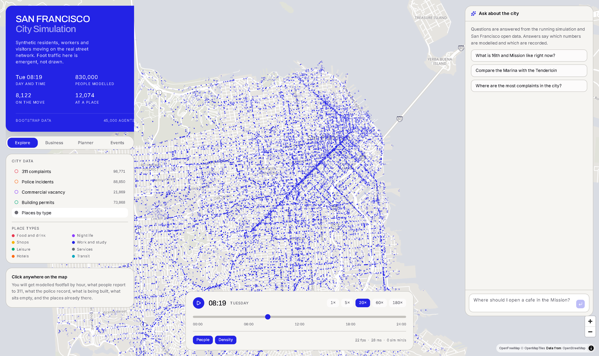
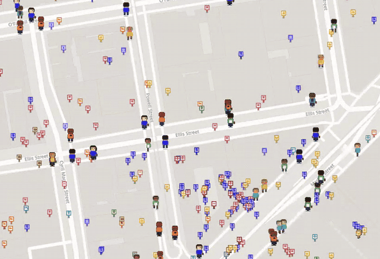

# San Francisco City Simulation

Synthetic residents, workers and visitors live a day on San Francisco's real
street network. Where they walk is not drawn: it emerges from who they are and
where they need to be. The resulting foot traffic answers questions for three
audiences — urban planners, city operations, and businesses choosing a site.



## The demo



8 seconds at street level: pixel residents walking real sidewalks, each one
following a schedule the simulation gave them, with places marked by category.

**[The full walkthrough](docs/video/streetlight-demo-720p.mp4)** runs 8:40,
recorded by driving a real browser against the running services, so every figure
on screen was computed during the take. GitHub serves committed video as a
download rather than playing it in the page, so the link saves the file, about
14 MB at 720p. Cloning gets it too.

| The city | The data | The three audiences |
|---|---|---|
| **00:04** The whole city at commute hour | **01:54** City data layers, one at a time | **03:08** Business: where to sign a lease |
| **00:18** Pushing in on downtown | **02:50** Clicking a block on the map | **05:47** Planner: the Tenderloin |
| **00:43** Street level: characters and signs | | **06:48** Operations: a sold-out game |
| | | **07:39** Time travel, then back to now |

The third column is the assistant answering in full. A chai house with a stated
budget, answered with real vacant addresses and quoted reviews. The Tenderloin's
complaints, walkability and permits, with the matching layers switched on
without being asked. A Warriors game at Chase Center, with the arrival curve,
the departure crush and the blocks that fill up.

[`docs/DEMO.md`](docs/DEMO.md) covers how to record it again.

## The three things it answers

**Businesses** — rank real vacant parcels for a category, with modelled footfall
by hour, ten-minute walking catchment, complementary trade nearby and existing
competition. Scores are relative to the candidate set, which the panel says.

**Planners** — click anywhere for land use, parcels, homes, retail floorspace,
permits filed, what residents report to 311 and what the police record.

**City operations** — drop a real fixture or any venue and see who comes, from
where, by what mode, arriving when, which rings around the doors fill up, and
which businesses sit inside the crowd.

Every view takes natural-language questions. Answers call the same tools the
panels do, and say which figures are modelled and which are recorded.

## What runs today

- **45,000 agents** on a 54,236-node walk network, routed over 132,128 cached
  polylines with 18.1 million vertices. A full simulated day takes 3.2 seconds.
- **53,059 real places** from Overture Maps, reduced to a 25-category catalog
  that drives destination choice through a distance-decay gravity model.
- **A bimodal commute** that emerges rather than being scripted: a morning peak
  near 8,800 people moving at once, an evening peak, and a dead night.
- **Animated figures** at street zoom — walking personas, buses, cars and
  bicycles — cross-fading into dots as you zoom out to the whole city.
- **Density as a halftone screen**, one dot per grid cell with area
  proportional to the people standing in it.
- **San Francisco open data**: 98,771 311 complaints, 88,850 police incidents,
  21,869 commercial vacancy filings, 73,868 building permits and 150,000 land
  use parcels, each on its own colour.
- **Live fixtures** from the MLB and NBA schedule feeds, needing no API key.

## Running it

```bash
npm install
uv sync --project apps/sim

# one-time: fetch places, then build the world (about 6 minutes)
uv run --project apps/sim python scripts/03_overture_places.py
uv run --project apps/sim python scripts/00_bootstrap.py --scope city --agents 45000
node scripts/make_sprites.mjs

# city open data: complaints, incidents, vacancy, permits, land use
uv run --project apps/sim python scripts/05_datasf.py

# census: population, income, rent, education, language, commute (no key needed)
uv run --project apps/sim python scripts/06_census.py

# two processes
npm run sim     # simulation service on :8000
npm run dev     # interface on :5173
```

### The assistant

Set one key in `.env` and the question box uses it:

```
LLM_PROVIDER=openai        # or anthropic
OPENAI_API_KEY=...         # or ANTHROPIC_API_KEY
```

Without a valid key the box still works: questions are routed by keyword to the
same tools and rendered from templates. The numbers are identical; only the
handling of unanticipated phrasing is lost, and the answer says so.

Optional, and free within Google's monthly allowance:

```bash
uv run --project apps/sim python scripts/04_google_enrich.py --max-calls 900
```

This attaches Google ratings and review counts to places and rebuilds the
attractiveness term. Review count is a popularity proxy with real biases —
chains and tourist spots accumulate reviews faster than neighbourhood
businesses serving the same number of people — so it is used as a relative
weight within a category, never as an absolute visit count.

## Verifying

```bash
uv run --project apps/sim pytest          # engine: movement, arrival, density
npx vitest run --root packages/protocol   # wire format, against Python bytes
node scripts/shoot.mjs --out docs/shots   # screenshots of the running app
```

The protocol tests decode bytes produced by the Python encoder, so the two
languages cannot drift apart silently.

## How it is put together

```
apps/web     interface: MapLibre basemap, deck.gl agents, poster-language HUD
apps/sim     simulation: FastAPI service, vectorized numpy tick, binary frames
packages/protocol  the wire format, shared by both
scripts      data pipeline and the sprite atlas generator
docs         research findings and screenshots
```

The simulation sends positions a few times a second as a binary struct of
arrays. The browser blends the two newest snapshots each animation frame and
hands the coordinate buffer straight to the GPU, so per-agent cost never
touches React.

## Data

All free. OpenStreetMap for the street network, Overture Maps for places,
OpenFreeMap for basemap tiles, and optionally Google Places for ratings.
See [docs/RESEARCH_SPEC.md](docs/RESEARCH_SPEC.md) for the wider survey of
sources and prior work.

### Census and demographics

Population questions are answered from the American Community Survey, covering
all 242 San Francisco census tracts and rolled up to the city's 42 analysis
neighbourhoods and 11 supervisor districts: population and age, household
income by race, contract rent, home value, rent burden, poverty, education,
employment, language spoken at home, place of birth, car ownership and commute
mode.

The Census Bureau's own API now rejects unauthenticated requests, so
`scripts/06_census.py` reads the same estimates from two keyless mirrors: Esri's
Living Atlas for the full ACS tables, and DataSF for counts the city has already
aggregated to neighbourhoods. Nothing here needs a signup.

Three rules are enforced in code and covered by tests, because breaking any of
them produces an answer that is confident and wrong:

- **Margins of error survive to the answer.** Every figure carries its margin. A
  figure whose margin exceeds a third of its value is marked imprecise, and
  comparing two places says outright when the gap between them falls inside the
  combined error.
- **Shares are recomputed from counts, never averaged.** Summing tract
  percentages once reported Chinatown as 475 percent Asian.
- **A broad category never stands in for a narrow one.** The keyless tables stop
  at "Asian" and "born in Asia". Asked about a specific national origin, the
  assistant returns the broad measures, says plainly that the census does not
  break that group out, and points at the language figures instead.

Rankings also hold out places whose base is too thin to measure. Seacliff's 55
percent cost-burdened renters rests on 229 renter households, and left in it
outranked the Tenderloin's 17,572. Held-out places are named in the result
rather than dropped silently.
